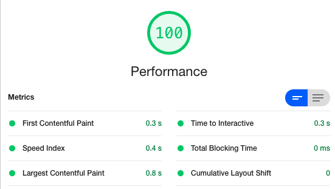
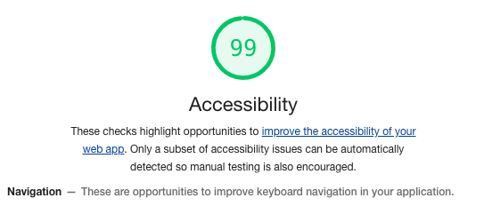

How Google sees your website plays a significant roll in search ranking and organic visibility. 

## Google scores your website performance (ie Speed),  how long until it's interactable, image load speeds, lazy loading and much more. 

## Even more important than speed is accessibility.  This is a measurement of how well your site performs for the audience who utilizes a screen reader or other accessibility features.
The best practices metric is how well "Google" can read your page structure. The information on your site isn't any good to anyone if Google doesn't know how to present it, or if it's relevant. 

Avery Websites can build your site from the ground up to perform amazing in all these tests.  I can also make your exisiting site better in most cases.  Use the Contact page for a no pressure consultation to find out how I can help you. 