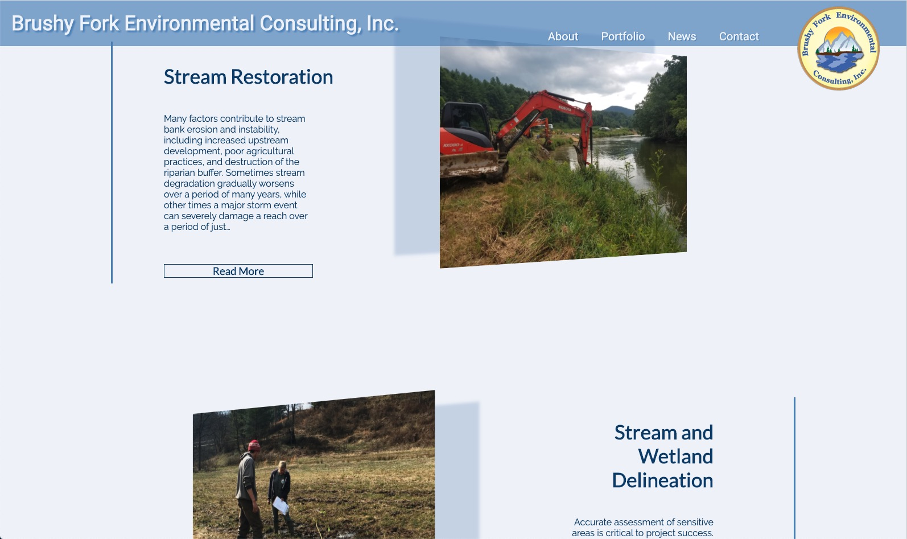
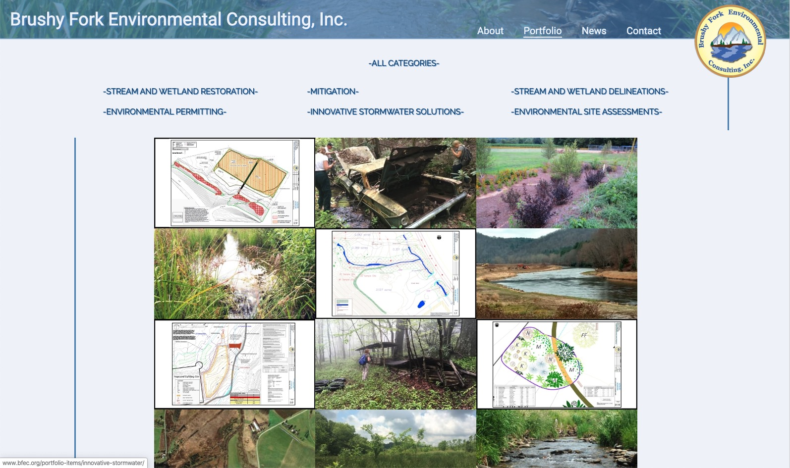

<!--  -->
[BFEC.org](https://www.bfec.org/) Custom built WordPress theme for Brushy Fork Environmental Consulting. This theme is built with several clean but eye catching animations. 

#### Features:
* -Custom portfolio item layout. It looks and feels like a plugin, but much lighter weight and faster. 
* -Custom post types. Custom post types allow for easy sorting of various content. 
* -End users have the ability to add Portfolio items, employees / bios, News, highlighted landing page posts, employment opportunies and more.  