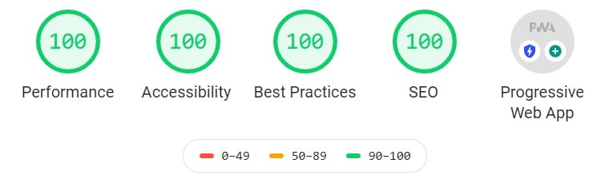

[Blue Ridge Propane](https://www.blueridgepropanenc.net/): Constructed (or re-constructed) in GatsbyJs.  This site was originally created with pure HTML/CSS/JS and PHP. When we decided to add a blog, the choice was GatsbyJs.  The design and look was not changed other than the addition of a blog and collapsable mobile menu. 

#### Features:
* -Uses Contentful for a [content management system](https://en.wikipedia.org/wiki/Content_management_system).  End users can add blog posts and products.
* -Images are [Lazy Loaded](https://en.wikipedia.org/wiki/Lazy_loading). Lazy loading is a design pattern commonly used in computer programming to defer initialization of an object until the point at which it is needed. It can contribute to efficiency in the program's operation if properly and appropriately used. "