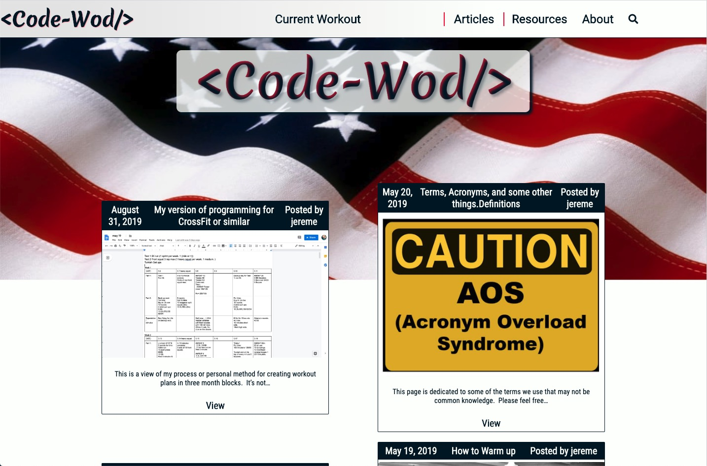

<!--  -->
[Code-Wod.com](https://www.code-wod.com/) is a fully custom WordPress theme. It's accessed by 90% mobile devices.  This is a personal project of mine.  On this platform I post a new free workout designed specifically for first responders every three days. 

#### Features:
* -Fully functional comment section on each of the workouts. Users can post scores or even questions about the workout. 
* -Custom post types. Custom post types allow for easy sorting of various content. Code-wod has 1 custom "Articles" and uses the standard Post for the workouts.
* -Integrated search ablilty. 