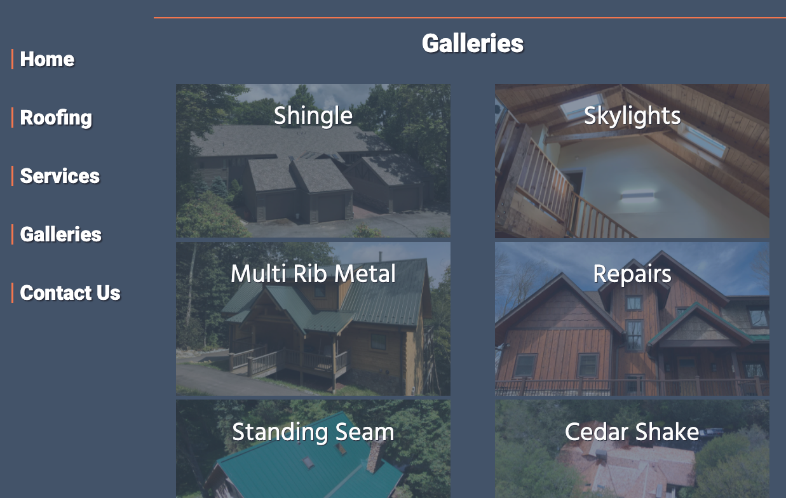

Brand new site build for Mountain Home Exteriors.  This site was a total rebuild.  It was originally a wix site. 

## Mountain Home Exteriors new site desktop version has a pinned navigation menu on the left side.  

## There's always new pictures from the various projects. These galleries are easily modifiable and updatable.
The images and many other things are stored in a Contentful CMS (content managment system). To add images to the galleries, add new galleries, remove galleries, or even basic image editing you need only to log into Contentful.  
## The site is built with a "Mobile First Design". 

### Full screen Mobile menu makes navagation on mobile devices easy.

Take a look at [Mountain Home Exteriors](https://www.mountainhomeext.com/) new site. They can help you with any roofing needs. 